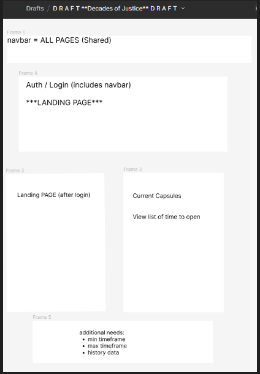

# MemoryBox

*Formerly DecadesOfJustice - RENAMED:  Legacy Locker*

_Vision to Set timer to 'lock' away **\_\_** for set time_

Generic timecapsules

landing page

authentication

create/read/update/delete timecapsule

## PROJECT BASICS:

**Angular Version:** 16.0.0

> _To check your angular version > open project, in terminal type: ng version_

**Bootstrap Version:** v5.3.2 - *using Bootstrap?*
  > *To check bootstrap version > open project, navigate to bootstrap.min.css; first line should show bootstrap version*

## TEAMWORK:

**COMMANDER IN CHARGE:  Will Wilder**

 - Landing Page:  **Kyle / Blake**
 - Header/Navbar; Routes/RouteGuard: **Wilicia**
 - Design/CSS/Responsive:  **Blake / Kyle**
 - Login/Auth:  **Trace / Wilicia**
 - API/Services/CRUD:   **Alex / Verona**
 - Project Notes:  **Verona**

**NodeJS Version:** TBD

> _To check nodeJS version > open project, in terminal type: node -v_

**Bootstrap Version:** TBD - _using Bootstrap?_

> _To check bootstrap version > open project, navigate to bootstrap.min.css; first line should show bootstrap version_

## TEAMWORK:

**COMMANDER IN CHARGE: Will Wilder**

- Landing Page: **Kyle**
- Header/Navbar; Routes/RouteGuard: **Wilicia**
- Design/CSS/Responsive: **Blake**
- Login/Auth: **Trace**
- Form structure & logic/API/Services/CRUD: **Alex**
- TBD: **Verona**

## DESIGN BASICS:

### Naming Convention(s):

> TBD

### Color Scheme:  **Blue / Black / White**

Color Pallet: https://colorhunt.co/palette/f6f1f119a7ce146c94000000

Style Color Palette: 
  - #F6F1F1 (white)
  - #19A7CE (lt blue)
  - #146C94 (darker blue)
  - #000000 (black)

  -**Landing Page:** TBD
### Color Scheme:

-**Landing Page:** TBD

-**Navbar:** TBD

-**Additional Pages:** TBD

-**Other:** TBD

### Classes ([naming] for styling & reference):

> TBD

---

